.. role:: strike

Hardening AWS Environments
==============================================================================

and
===

Automating Incident Response
===============================

Andrew Krug & Alex McCormack

@andrewkrug   @amccomarck

.. note:: Andrew Speaks

----------------

Before we get started
=======================

ImageCredit: OddDuckart

http://bit.ly/2cl6qJ2

.. note:: Andrew Speaks

-----------------

About Us
==========

.. note:: Andrew Speaks

-----------------

Important Things
==================

* We are not a corporation
* No one pays us to do this
* Everything we're going to talk about is FOSS

Other important things
-----------------------

* We all have day jobs on the ThreatResponse Team
* These are our opinions not the opinion of our employer.

.. note:: Andrew Speaks

-----------------

Download the Slides
===================

* http://threatresponse.cloud
* http://threatresponse.cloud/derbycon

.. note::  Andrew Speaks

-------------------

Today's Agenda
===============

AWS Developments in the Last Year
-------------------------------------

Incident Response within AWS
-------------------------------------

Advanced Attacks and Defenses in AWS
-------------------------------------

Final Tips & Resources
-------------------------------------

.. note:: Alex Speaks

-------------------------

What's going on in AWS Security: Blog Posts
===========================================

Daniel Grezelak
----------------------------------------------

 - `Backdooring an AWS account <https://danielgrzelak.com/backdooring-an-aws-account-da007d36f8f9>`_

 - `Exploring an AWS account post-compromise <https://danielgrzelak.com/exploring-an-aws-account-after-pwning-it-ff629c2aae39?source=latest>`_

 - `Disrupting AWS logging <https://danielgrzelak.com/disrupting-aws-logging-a42e437d6594?source=latest>`_

Toni de la Fuente
----------------------------------------------
 - `Cloud Forensics: CAINE7 on AWS <http://blyx.com/2016/06/16/cloud-forensics-caine7-on-aws/>`_

 - `Forensics in AWS: an introduction <http://blyx.com/2016/03/11/forensics-in-aws-an-introduction/>`_

Eric Hammond
----------------------------------------------

 - `AWS IAM "ReadOnlyAccess" Managed Policy is Too Permissive (For Us) <https://alestic.com/2015/10/aws-iam-readonly-too-permissive/>`_

.. note:: Andrew Speaks

-----

What's going on in AWS Security: Blackhat Talks
===============================================

Dan Amiga and Don Knafo
----------------------------------------------

 - `Account Jumping, Post Infection Persistence, and Lateral Movement in AWS <http://ubm.io/2dfeStx>`_

Loic Simon
----------------------------------------------

 - `Access Keys will kill you before you kill the password <http://ubm.io/2czdg9S>`_

This Talk, v1
---------------

 - `Hardening AWS Environments and Automating Incident Response for AWS Compromises <https://s3-us-west-2.amazonaws.com/threatresponse-static/us-16-Krug-Hardening-AWS-Environments-and-Automating-Incident-Response-for-AWS-Compromises-wp.pdf>`_

.. note:: Andrew Speaks

-----

Today's Agenda
===============

AWS Developments in the Last Year
-------------------------------------

*Incident Response within AWS*
-------------------------------------

 - Preparation
 - Identification
 - Containment
 - Eradication
 - Recovery

Advanced Attacks and Defenses in AWS
-------------------------------------

Final Tips & Resources
-------------------------------------

.. note:: Alex Speaks

-------------------------

Today's Agenda
===============

AWS Developments in the Last Year
-------------------------------------

*Incident Response within AWS*
-------------------------------------

 - Preparation
 - Identification
 - Containment
 - Eradication
 - :strike:`Recovery`

Advanced Attacks and Defenses in AWS
-------------------------------------

Final Tips & Resources
-------------------------------------

.. note:: Alex Speaks

-------------------------

IR in AWS: Preparation
======================================

Understand the Environment
--------------------------

 - `Amazon AWS Security Best Practices Guide <https://d0.awsstatic.com/whitepapers/Security/AWS_Security_Best_Practices.pdf>`_

 - `CIS AWS Foundations Benchmark <https://d0.awsstatic.com/whitepapers/compliance/AWS_CIS_Foundations_Benchmark.pdf>`_

Develop an Incident Response Plan
----------------------------------

 - Tom Arnold's `Incident Response in Amazon EC2: First Responders Guide to Security Incidents in the Cloud <https://www.sans.org/reading-room/whitepapers/incident/incident-response-amazon-ec2-first-responders-guide-security-incidents-cloud-36902>`_

----

IR in AWS: Preparation
======================================
`Awesome Incident Response <https://github.com/meirwah/awesome-incident-response>`_
-----------------------------------------------------------------------------------------------------------------------------------------

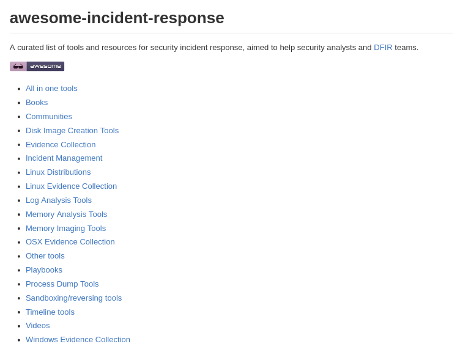

----

IR in AWS: Preparation
======================================
`Awesome Incident Response <https://github.com/meirwah/awesome-incident-response>`_
-----------------------------------------------------------------------------------------------------------------------------------------

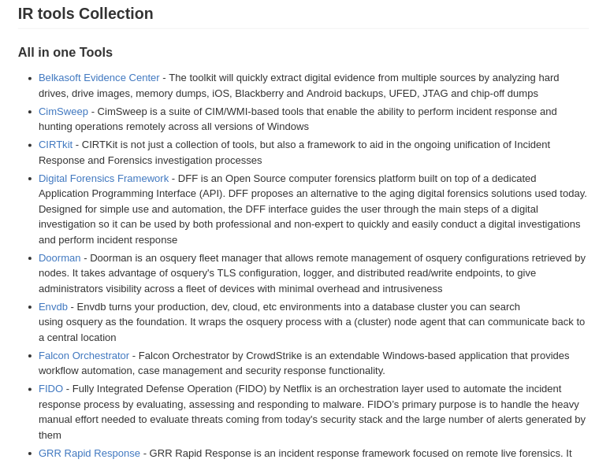

----

IR in AWS: Preparation
======================================
`Awesome Incident Response <https://github.com/meirwah/awesome-incident-response>`_
-----------------------------------------------------------------------------------------------------------------------------------------

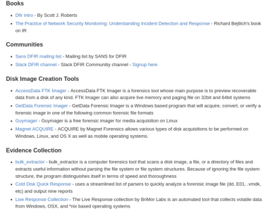

----

IR in AWS: Prep - Hardening
======================================

Best Practices Auditing
-----------------------

 - `AWS Trusted Advisor <https://aws.amazon.com/premiumsupport/trustedadvisor/>`_

 - `AWS Config / Config Rules <https://aws.amazon.com/config/>`_

 - `Prowler <https://github.com/Alfresco/aws-cis-security-benchmark>`_

 - `Scout2 <https://github.com/nccgroup/Scout2>`_

 - `CloudCustodian <https://github.com/capitalone/cloud-custodian>`_

 - `SecurityMonkey <https://github.com/Netflix/security_monkey>`_

IAM User / Policy Auditing
----------------------------

 - `Access Advisor <http://docs.aws.amazon.com/IAM/latest/UserGuide/access_policies_access-advisor.html>`_
 - `Using CloudTrail Logs <http://threatresponse.cloud/blog/2016/tips_for_least_privilege_iam_policies.html>`_
 - Video: `AWS (SEC305) How to Become an IAM Policy Ninja in 60 Minutes or Less <https://www.youtube.com/watch?v=Du478i9O_mc>`_

.. note:: Alex Speaks
  Part of being prepared is hardening your systems and environment. But you can't just set it up and walk away, you should have a system of consistently evaluating your state to make sure your following the best practices.

------

IR in AWS: Prep - Hardening
======================================

`AWS Trusted Advisor <https://aws.amazon.com/premiumsupport/trustedadvisor/>`_
-------------------------------------------------------------------------------

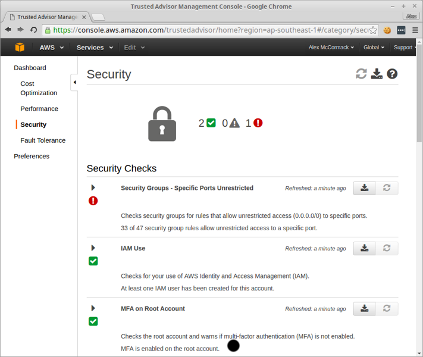

.. note:: Alex Speaks

  around 12 built in checks, but only 3 or 4 for free

  Full checks come with a business or enterprise support plan starting at 100 a month.

  No API

  But it is CEO Friendly.

------

IR in AWS: Prep - Hardening
======================================

`AWS Config / Config Rules <https://aws.amazon.com/config/>`_
-------------------------------------------------------------------------------

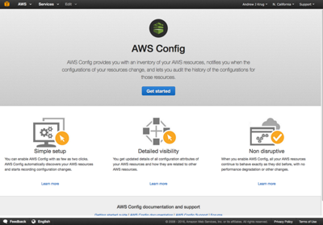

.. note::

  Config deals with logging what is called a configuration item for supported AWS resources whenever a supported resource is created, deleted, or changed.

  AWS Config rules is a distinct offering from config. Config deals with logging, Config Rules evaluates the configuration item against a set of predefined critieria

  AWS provides a set of configurable rules users may use, as well as the ability to make custom rules.

  Configuration item $0.003 , Rule $2.00 for 20,000 evaluations / month.

------

IR in AWS: Prep - Hardening
======================================

`Prowler <https://github.com/Alfresco/aws-cis-security-benchmark>`_
-------------------------------------------------------------------------------

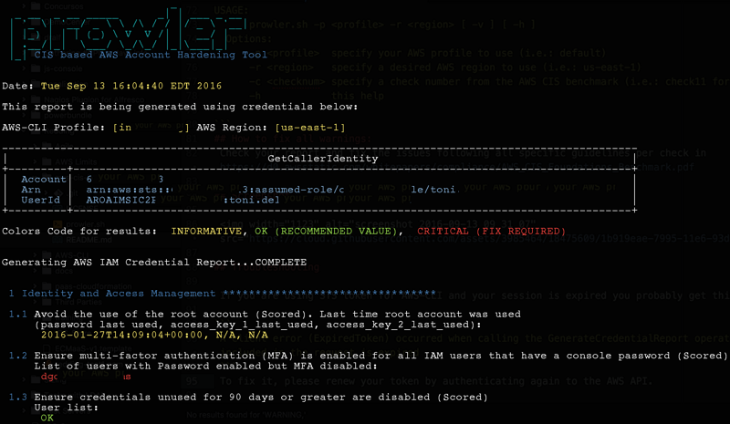

.. note::
  By our friend Toni De La Fuente

  **What we love about it!**

  * CIS Benchmarking Tool
  * Can run out of your cloud
  * Meaningful report data
  * Actionable changes

------

IR in AWS: Prep - Hardening
======================================

`Scout2 <https://github.com/nccgroup/Scout2>`_
-------------------------------------------------------------------------------

 TODO

------

IR in AWS: Prep - Hardening
======================================

`CloudCustodian <https://github.com/capitalone/cloud-custodian>`_
-------------------------------------------------------------------------------

**What we love about it!**

* Rule Based Approach
* Has dry run
* Can run on premise or in another account
* It solves real compliance problems that you have

----

IR in AWS: Prep - Hardening
======================================

`SecurityMonkey <https://github.com/Netflix/security_monkey>`_
-------------------------------------------------------------------------------

**What we love about it!**

* It's Django
* Docker Container Support
* Tracks item states over time
* Security Scorecards your account
* Can run in a bastion

------------------------------

IR in AWS: Prep - Hardening
======================================

Which tool should use use?
-------------------------------

 * *Whatever works best for your environment*
 * Experiment with multiple tools

Implement Something Immediately
--------------------------------

 * Start with simple tools like Prowler
 * Move on to more complex tools as needed.

------------------------------

IR in AWS: Prep - Hardening
======================================

Best Practices Auditing
-----------------------

 - `AWS Trusted Advisor <https://aws.amazon.com/premiumsupport/trustedadvisor/>`_

 - `AWS Config / Config Rules <https://aws.amazon.com/config/>`_

 - `Prowler <https://github.com/Alfresco/aws-cis-security-benchmark>`_

 - `Scout2 <https://github.com/nccgroup/Scout2>`_

 - `CloudCustodian <https://github.com/capitalone/cloud-custodian>`_

 - `SecurityMonkey <https://github.com/Netflix/security_monkey>`_

*IAM User / Policy Auditing*
----------------------------

 - `Access Advisor <http://docs.aws.amazon.com/IAM/latest/UserGuide/access_policies_access-advisor.html>`_
 - `Using CloudTrail Logs <http://threatresponse.cloud/blog/2016/tips_for_least_privilege_iam_policies.html>`_
 - Video: `AWS (SEC305) How to Become an IAM Policy Ninja in 60 Minutes or Less <https://www.youtube.com/watch?v=Du478i9O_mc>`_

.. note:: Alex Speaks
  Part of being prepared is hardening your systems and environment. But you can't just set it up and walk away, you should have a system of consistently evaluating your state to make sure your following the best practices.

----

IR in AWS: Prep - Hardening
======================================

Access Advisor
-------------------------------

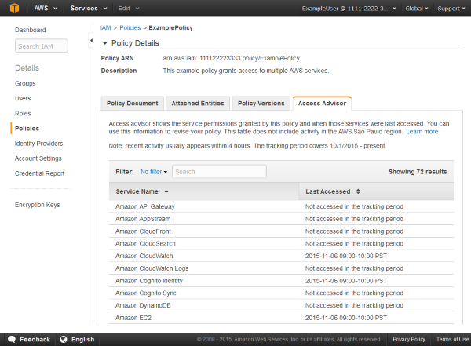

------------------------------

IR in AWS: Prep - Hardening
======================================

`Policy Tuning with CloudTrail <http://threatresponse.cloud/blog/2016/tips_for_least_privilege_iam_policies.html>`_
-------------------------------------------------------------------------------------------------------------------------------

.. code-block:: bash

    almac@box ~/Downloads $ cat 114406602329_CloudTrail_us-east-1_20160913* |  \
      jq -c \
      '.Records[] |
        {
         eventName: .eventName,
         userName: .userIdentity.userName,
         eventSource: .eventSource
        } |
        select(.userName=="threatpreppolicytest") |
        [.eventSource, .eventName]' \
    | sort | uniq

    ["cloudtrail.amazonaws.com","DescribeTrails"]
    ["ec2.amazonaws.com","DescribeFlowLogs"]
    ["ec2.amazonaws.com","DescribeRegions"]
    ["ec2.amazonaws.com","DescribeVpcs"]
    ["iam.amazonaws.com","GenerateCredentialReport"]
    ["iam.amazonaws.com","GetCredentialReport"]
    ["iam.amazonaws.com","ListAttachedUserPolicies"]

Video: `AWS (SEC305) How to Become an IAM Policy Ninja in 60 Minutes or Less <https://www.youtube.com/watch?v=Du478i9O_mc>`_

------------------------------

IR in AWS: Prep - Hardening
======================================

Practice
-------------------------------

TODO

------------------------------

Today's Agenda
===============

AWS Developments in the Last Year
-------------------------------------

*Incident Response within AWS*
-------------------------------------

 - Preparation
 - *Identification*
 - Containment
 - Eradication

Advanced Attacks and Defenses in AWS
-------------------------------------

Final Tips & Resources
-------------------------------------

.. note:: Alex Speaks

-------------------------

IR in AWS: Identification
======================================

CloudTrail
-------------------------------

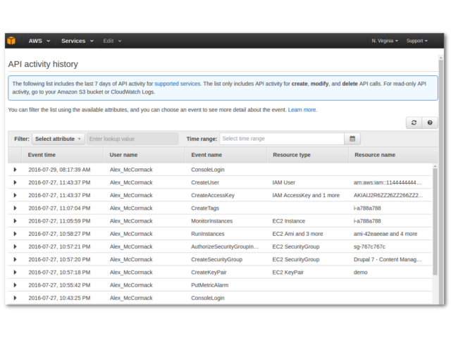

-----------

IR in AWS: Identification
======================================

CloudWatch
-------------------------------

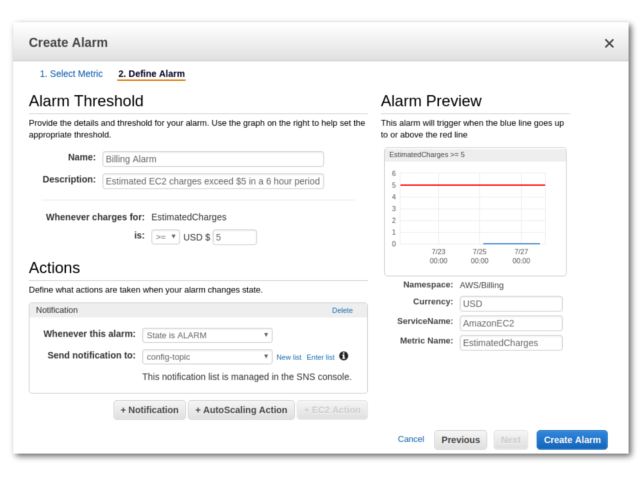

----

IR in AWS: Identification
======================================

`AWS CloudFormation Template For Security Events in CloudTrail <https://console.aws.amazon.com/cloudformation/home?region=us-east-1#/stack/detail?stackId=arn:aws:cloudformation:us-east-1:114406602329:stack%2FCloudWatchAlarmsForCloudTrail%2F24762880-5737-11e6-8abc-50d5cd148236>`_

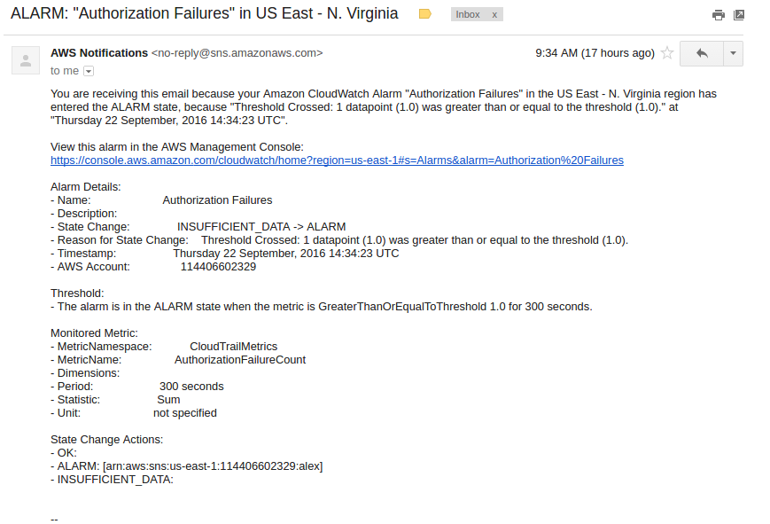

.. note::
    Auth failures (denials)

    CloudTrail Changes

    Console Signin Failures

    Ec2 Instance Changes

    Gateway changes

    IAM Policy Changes

    Network AclChanges

    SecurityGroupChanges

    VpcChanges

    Andrew will give another example of detection in CloudWatch.

----

Today's Agenda
===============

AWS Developments in the Last Year
-------------------------------------

*Incident Response within AWS*
-------------------------------------

 - Preparation
 - Identification
 - *Containment*
 - Eradication

Advanced Attacks and Defenses in AWS
-------------------------------------

Final Tips & Resources
-------------------------------------

.. note:: Alex Speaks

-------------------------

IR in AWS: Containment
======================================

Using aws_ir to:
-----------------

Contain a Host Compromise

and
---

Contain a Key Compromise

----

IR in AWS: Containment
======================================

Containing a Host Compromise
-------------------------------

 - Implement a security group to block all in/out traffic except to whitelist.
 - Implement a network ACL.

aws_ir usage
---------------

.. code-block:: bash

    aws_ir host_compromise 1.2.3.4

---------

IR in AWS: Containment
======================================

Containing a Key Compromise
-------------------------------

 - Disable the access key.
 - Block STS Tokens.

aws_ir usage
---------------

.. code-block:: bash

    aws_ir key_compromise AYAabyabyabyabyabya

---------

Host Compromise leads to
=========================
Key Compromise
==================================

Ever heard of the metadata service?
-------------------------------------

-----------------

**MetaData Service**

.. code-block:: bash

    https://aws.amazon.com/amazon-linux-ami/2016.03-release-notes/
    13 package(s) needed for security, out of 26 available
    Run "sudo yum update" to apply all updates.
    [ec2-user@ip-172-31-37-29 ~]$ curl http://169.254.169.254/latest/meta-data/
    ami-id
    ami-launch-index
    ami-manifest-path
    block-device-mapping/
    hostname
    iam/
    instance-action
    instance-id
    instance-type
    local-hostname
    local-ipv4
    mac
    metrics/
    network/
    placement/
    profile
    public-hostname
    public-ipv4
    public-keys/
    reservation-id
    security-groups

-----------------

**Determine Instance Profile**

.. code-block:: bash

    curl http://169.254.169.254/latest/meta-data/iam/info
    {
      "Code" : "Success",
      "LastUpdated" : "2016-09-21T17:00:07Z",
      "InstanceProfileArn" : "arn:aws:iam::671642278147:instance-profile/\

      cloudresponse_workstation-cr-16-080120-e5c0-us-west-1",

      "InstanceProfileId" : "AIPAJJWTONXQ7CLMRENCO"
    }

-----------------

**Once you know the role name**

.. code-block:: bash

    curl http://169.254.169.254/latest/meta-data/iam/\
    security-credentials/cloudresponse_workstation-cr-16-080120-e5c0-us-west-1
    {
      "Code" : "Success",
      "LastUpdated" : "2016-09-21T17:00:55Z",
      "Type" : "AWS-HMAC",
      "AccessKeyId" : "ASIAJDU**********REDACTED",
      "SecretAccessKey" : "q7bVQVlV+9/ktjWgh5******REDACTED",
      "Token" : "FQoDYXdzEGIaDGlEkwRSH8hHG+Oz***********REDACTED",
      "Expiration" : "2016-09-21T23:05:14Z"
    }

Winning!
================================

-----------------

So what?
===============

You can protect against this
--------------------------------

Good old iptables to the rescue.

.. code-block:: bash

    iptables -A OUTPUT -m owner ! —uid-owner root -d 169.254.169.254 -j DROP

.. note::
  TODO - Doesn't this prevent STS from working?

-----------------

Key Compromise leads to
=========================
Host Compromise
==================================

 1. Snapshot Disk for Targeted Host

 2. Mount Snapshot onto attacker-controlled image

 3. ???

 4. Profit!

-----------------

Today's Agenda
===============

AWS Developments in the Last Year
-------------------------------------

*Incident Response within AWS*
-------------------------------------

 - Preparation
 - Identification
 - Containment
 - *Eradication*

Advanced Attacks and Defenses in AWS
-------------------------------------

Final Tips & Resources
-------------------------------------

.. note:: Alex Speaks

-------------------------

IR in AWS: Eradication
=======================

 .. raw:: html

     

     

----

IR in AWS: Eradication
=======================

Evidence Data to Collect
---------------------------

 1. AWS Data
 2. Disk
 3. Memory
 4. Network

And store in a case specific S3 bucket
-----------------------------------------

----

IR in AWS: Eradication
=======================

Evidence Data to Collect: AWS Data
-----------------------------------------

 1. EC2 Console Output
 2. EC2 Console Screenshot
 3. AWS Meta-Data

  - Attached Device Volume IDs
  - Network Devices and Local / Public IPs
  - AMI-ID

 4. Relevant CloudTrail Logs

  - Coming soon to aws_ir

----

Analyze Evidence: EC2 Disks
=====================================

Snapshot attached disks.

Analyze with ThreatResponse Workstation.

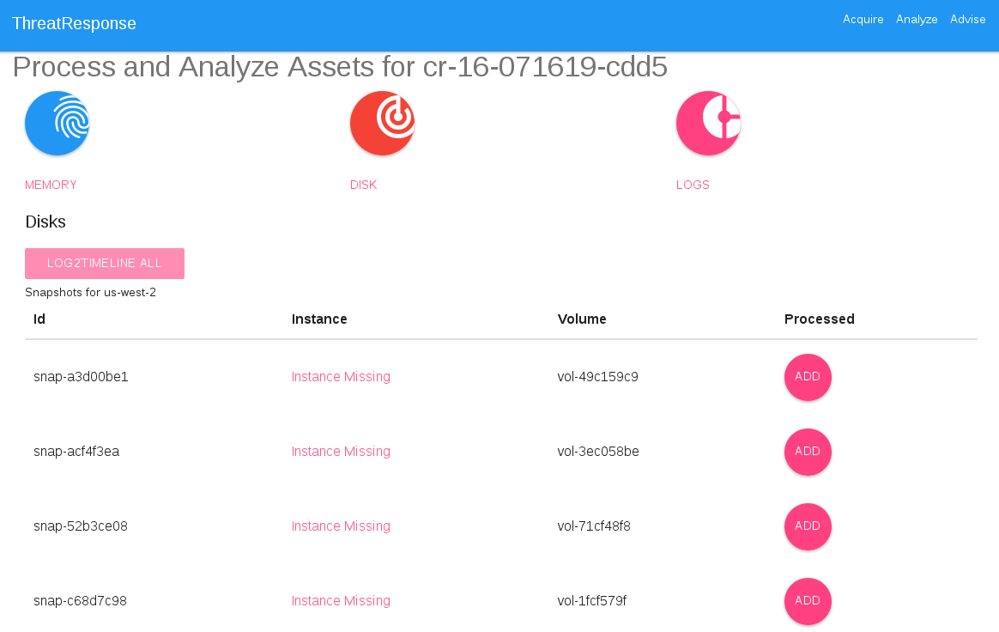

----

Analyze Evidence: EC2 Disks
=====================================

.. image:: static/disk-processing2.svg
    :width: 840px

----

Analyze Evidence: EC2 Disks
=====================================

`TimeSketch <https://github.com/google/timesketch>`_

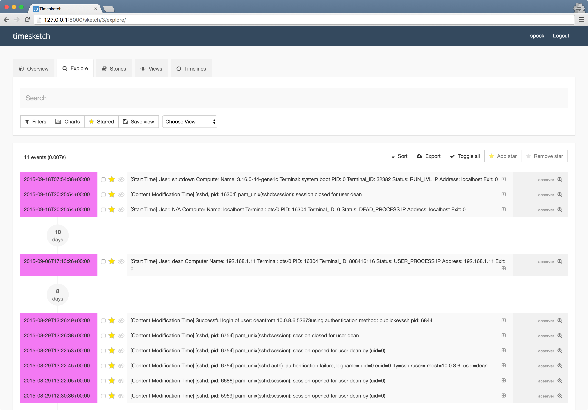

----

IR in AWS: Eradication
=======================

Evidence Data to Collect: Memory
-----------------------------------------

`Margarita Shotgun <https://github.com/ThreatResponse/margaritashotgun>`_
---------------------------------------------------------------------------------------------------

 By Joel Ferrier

 Memory Acquisition Process

 - SSH to target using Paramiko
 - Determines Kernel
 - Copies over Kernel Module

  - **We have most most kernel modules pre-compiled for Amazon Certified AMIs**

 - Copies memory to an S3 bucket using a secure network connection

----

Analyze Evidence: Memory
=====================================

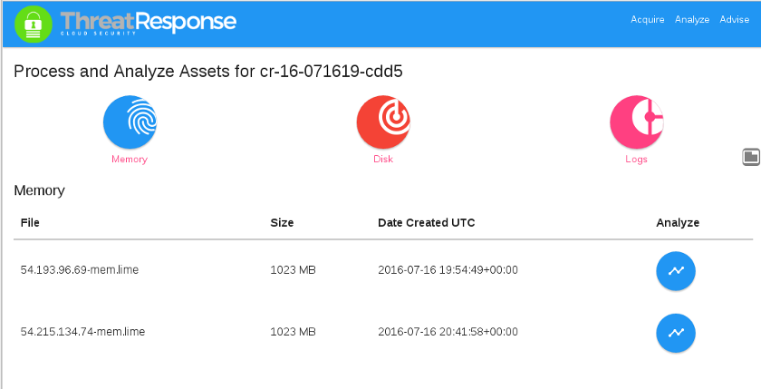

----

Analyze Evidence: Memory
=====================================

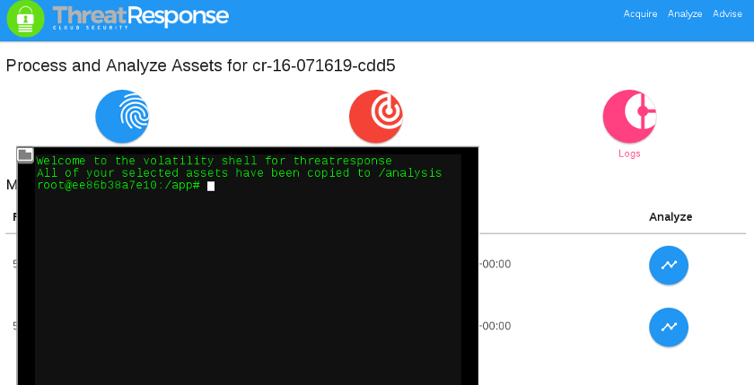

----

IR in AWS: Eradication
=======================

Evidence Data to Collect: Network
-----------------------------------------

**You may get some network information from memory**

**More information from VPC Flow Logs**
 - Coming soon to aws_ir

---------------------

IR in AWS: Conclusion
=======================

Covered Lots of Preparation Tools
---------------------------------

Trusted Advisor, Config, Prowler, Scout2, CloudCustodian, SecurityMonkey

Covered 3 ThreatResponse Tools
-------------------------------

aws_ir, Margarita Shotgun, ThreatResponse Web

Takeaways
----------

 - Customize tooling for your environment
 - Use all (or parts) our code.  **It's MIT Licensed**
 - Practice, Practice, Practice

------

Today's Agenda
===============

AWS Developments in the Last Year
-------------------------------------

Incident Response within AWS
-------------------------------------

*Advanced Attacks and Defenses in AWS*
--------------------------------------

Final Tips & Resources
-------------------------------------

.. note:: Alex Speaks

-------------------------

The AWS Security ECO System
=============================

Basically all you need is:

1. Word about a Cloud
2. Action or a Place
3. ( Optional a thing to operate on )

You too can make Product Madlibs
--------------------------------

-----------------

Attack Time!
==============================

Trivia Question
----------------

Who Said: "Defense without Offense is after all just Compliance."

---------------------------

A: "Dan Kaminsky in Read My Lips: Let’s Kill 0Day"

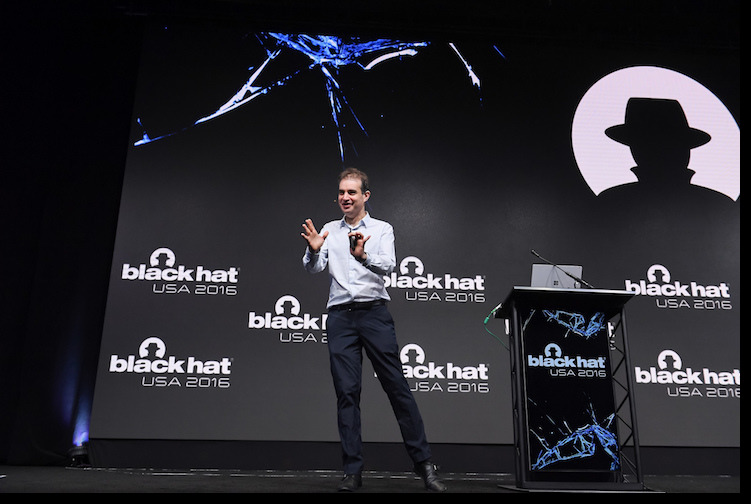

-----------------------------

Attack Scenario
=============================

Imagine .... once upon a time

-----------------------------

Attack Retrospective
=============================

------------------------------

AWS Advanced Attacks
================================

* Logging Disruption
* STS Persistence
* *New* Super Cool API Gateway Persistence

------------------------------

PSA : GroundRules
=============================

Non-Boring Material Ahead!
----------------------------

------------------------------

Logging Disruption
===============================================

Three Variations of This
---------------------------

1. Just Stop Trail - Boring
2. Stop Regional Logging or Global Logging - Less Boring
3. Make CloudTrail operate but logs are unreadable - Best!!

------------------------------

The Cool Attack
======================================

This is your CloudTrail
------------------------------------

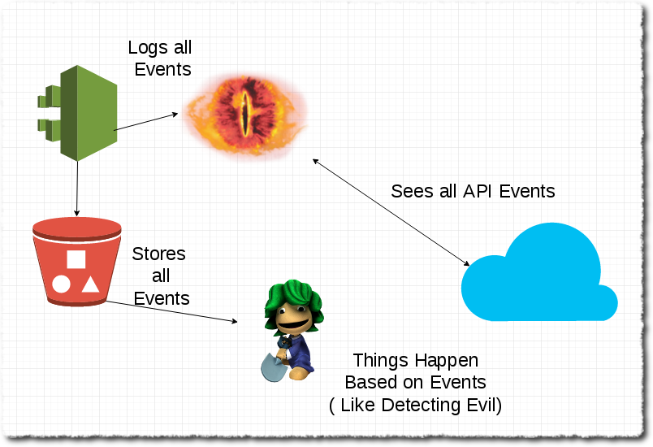

------------------------------

**This is your CloudTrail on Crypto**

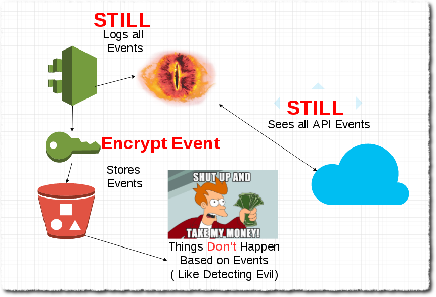

----------------------------------

When the attack happens...
==============================================

The “bypass-policy-lockout-safety-check” flag allows you the make the key’s
policy immutable after creation, making logging just an exercise in lighting
money on fire with disk consumption. You can’t say Amazon didn’t warn you!
- @danielgrzelak

----------------------------------

1. Requires a high level of privilege
2. Handy for remaining undetected
3. Not necessarily undetectable...

----------------------------------

Not Normal Activities Here
==============================

1. Creating KMS Keys with this weird policy
2. Calling update trail on your cloudtrail

----------------------------------

http://bit.ly/2cnpTsK
=================================

There's an article about this type of detection.
----------------------------------------------------

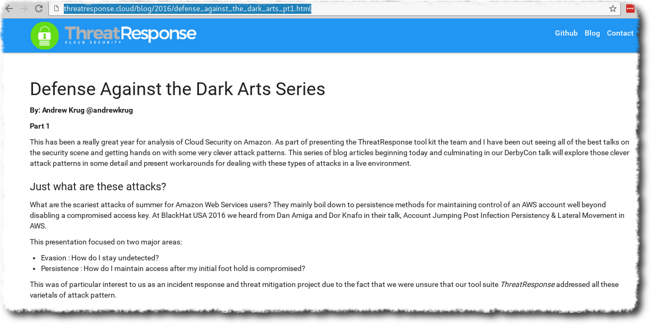

----------------------------------

CloudWatch Event Pipelines
=========================================

For the win
-------------------

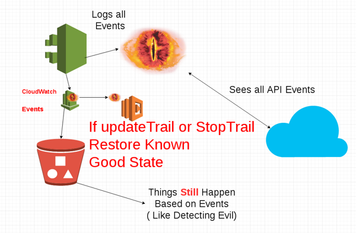

----------------------------------

Video of CloudWatch Pipeline
================================

.. raw:: html

    <video width="824" height="376" controls>
      <source src="videos/advcloudtrail.webm">
    Your browser does not support the video tag.
    </video>

----------------------------------

STS Attacks
======================================

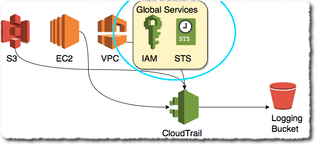

----------------------------------

How do they happen?
=====================================

1. Metadata Compromise
2. As a result of key compromise
3. Leaked through an application running in a role

----------------------------------

How do you generate them?
=======================================

.. code-block:: bash

    kali:$ aws sts get-session-token --duration-seconds 129600

---------------------------------

What you get back
==========================

.. code-block:: bash

    {
        "Credentials": {
            "SecretAccessKey": "S/aDDL86juKF3*****************************",
            "SessionToken": "FQoDYXdzEG***********************************",
            "Expiration": "2016-09-23T05:26:51Z",
            "AccessKeyId": "ASIAJ5*****************************"
        }
    }

---------------------------------

So what?
==================================

1. You can't revoke temporary STS tokens
2. Without CloudTrail you have no way to know how many exist
3. Someone can use these to end you

--------------------------------

Companies have ceased to be.
==================================

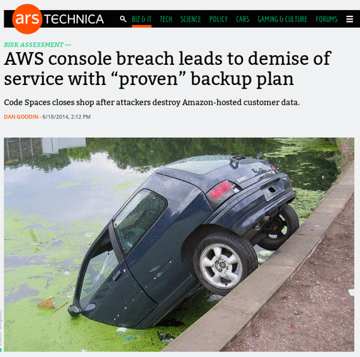

--------------------------------

Trust is hard to gain!
============================================

Easy to lose.
---------------------------------

--------------------------------

How do you
=================================

defend against STS?
=====================

--------------------------------

You don't.
=============

--------------------------------

J/K
=======================

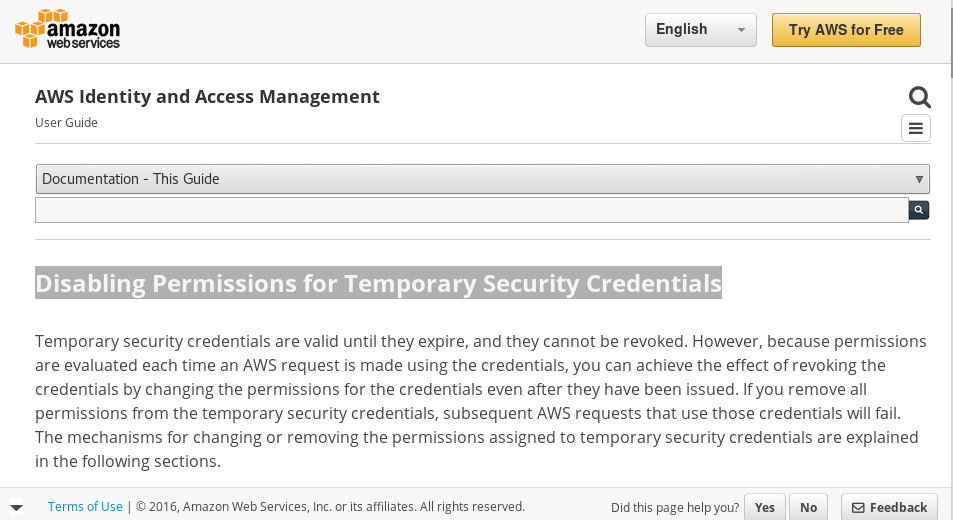

-------------------------------

Three Supported Techniques
=================================

1. Denying Access to the Creator
2. Denying Access to by Name

3. **Denying Access to Credentials
Issued Before xx/xx/xx 00:00:00**

-------------------------------

Time Based Revocation
====================================

.. code-block:: bash

    {
      "Version": "2012-10-17",
      "Statement": {
        "Effect": "Deny",
        "Action": "*",
        "Resource": "*",
        "Condition": {"DateLessThan": {"aws:TokenIssueTime": "2014-05-07T23:47:00Z"}}
      }
    }

1 and done policy attach to all roles
---------------------------------------

--------------------------------

Go defend!
==================

--------------------------------

Backdoors via API Gateway!
==========================================

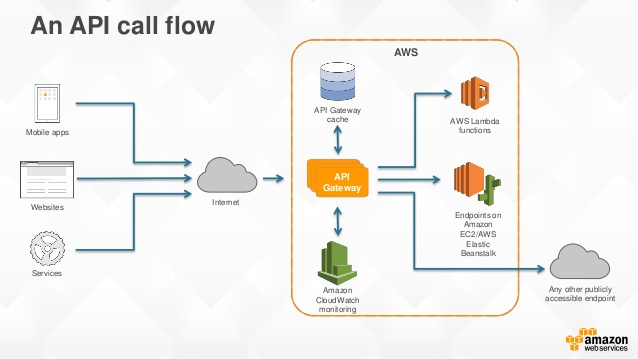

--------------------------------

Serverless is the Future
============================

I agree!
-------------------

--------------------------------

Serverless is the future!
====================================

Of attacks!
=======================

--------------------------------

What could you do with serverless attacks?
============================================

1. Backdoors
2. Exfiltrate data via http
3. Run a CNC for BotNet
4. Run a ransomware backend....

Endless Possibility
----------------------

--------------------------------

Why make a backdoor tool?
==============================

Trivia Question
----------------

Who Said: "It was once my job to think as Dark Wizards do?"

-----------------------------

.. code-block:: bash

    Professor Moody: The Goblet of Fire is an exceptionally powerful magical object.
    Only an exceptionally powerful Confundus charm could have hoodwinked it!
    Magic way beyond the talents of a fourth year.
    Igor Karkaroff: You seem to have given this a fair bit of thought, Mad-Eye!

A: "Mad Eye Moody"

-----------------------------

Mad King Demo
=================================

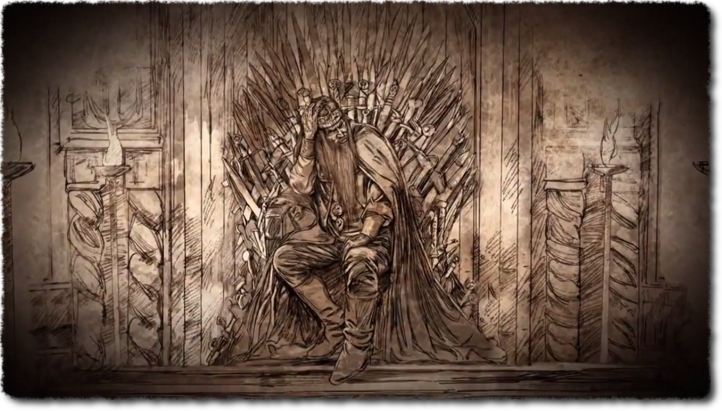

------------------------------

Just Imagine
============================

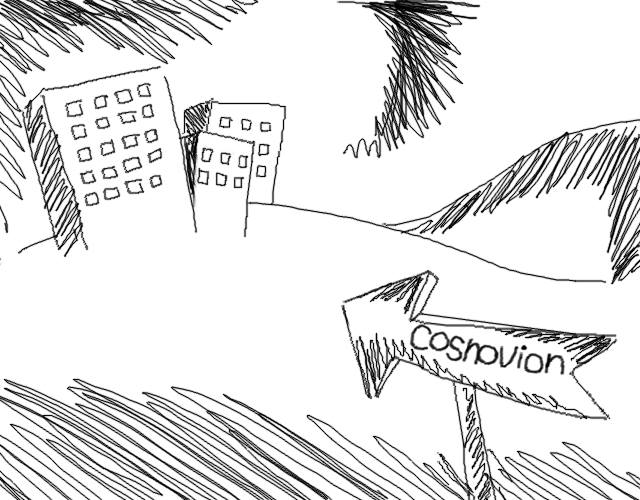

You're working in the magical land of Cosnovion.

------------------------------

Then bad things happen
============================

One of your developers leaks a super privileged access key...

------------------------------

You save the day?
============================

They said give us some money or else.  Boss asks you to clean the account.
And you do! You even revoked STS Tokens!

-------------------------------

Attackers end your company
============================

Attackers end your company through a super cool new type of persistence.

--------------------------------

Fin
============================

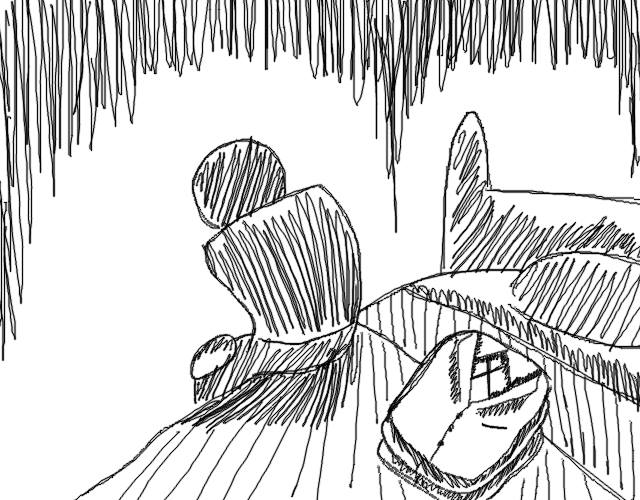

The End

--------------------------------

So what?
=================================

Let's look at the MadKing
--------------------------

------------------------------

.. raw:: html

    

    

-------------------------------

.. raw:: html

    <video width="824" height="376" controls>
      <source src="videos/madking.webm">
    Your browser does not support the video tag.
    </video>

-------------------------------

Did we just burn them all?
===================================

-------------------------------

So what?
==================

1. Small payload
2. Gives you persistence
3. Cleans up it's own logs when it goes away
4. Most platforms probably aren't auditing serverless
5. No security groups for APIGateway endpoints

-------------------------------

Today's Agenda
===============

AWS Developments in the Last Year
-------------------------------------

Incident Response within AWS
-------------------------------------

Advanced Attacks and Defenses in AWS
-------------------------------------

*Final Tips & Resources*
-------------------------------------

.. note:: Andrew Speaks

-------------------------

How do we even begin to protect ourselves?
===========================================

------------------------------

No less than:
===========================================

Three Dumb Clouds
------------------

.. image:: static/dev-in-aws.png
    :align: center

Is this three dumb clouds?

--------------

Nah... this is three dumb clouds
===================================

.. image:: static/seperated-envs.png
    :align: center

--------------

Maybe we need four clouds
============================

.. image:: static/securitycloud.jpg
    :align: center

------------------------------

Project Comparison
===========================================

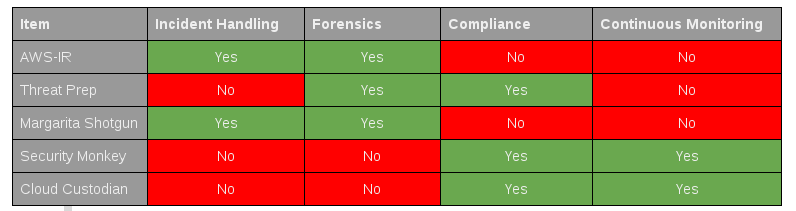

------------------------------

Want more information?
==========================================

Subscribe to our mailing list
--------------------------------

http://www.threatresponse.cloud

------------------------------

Future Features of Our Tools
==========================================

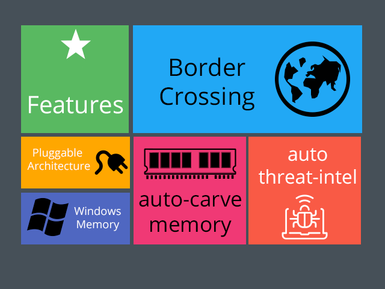

------------------------------

Thank Yous and Announcements
==========================================

* Amazon Web Services Security
      Don Bailey, Henrik Johansson, Zack Glick
* DerbyCon Staff
* Toni De la Fuente
* Shyla Roach - Illustrations in slides
* Team Who Couldn't Be with Us Today

------------------------------

Don't let me forget to take questions...
==========================================

------------------------------

Srsly any questions? ...
==========================================
