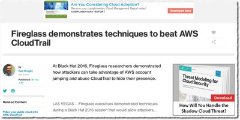
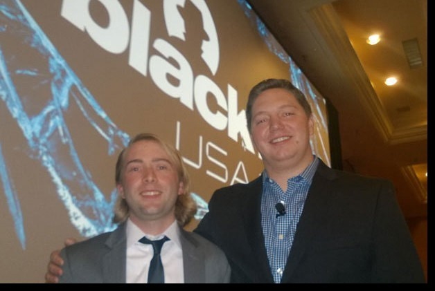
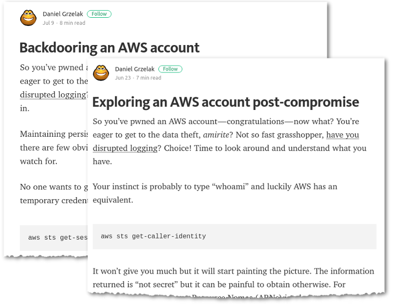

Hardening AWS Environments
==============================================================================

and
===

Automating Incident Response
===============================

Andrew Krug & Alex McCormack

@andrewkrug   @amccomarck

----------------

Before we get started
=======================

.. image:: static/pwnie.png

ImageCredit: OddDuckart

http://bit.ly/2cl6qJ2

-----------------

About Us
==========

.. image:: static/team.png

-----------------

Important Things
==================

* We are not a corporation
* No one pays us to do this
* Everything we're going to talk about is FOSS

Other important things
-----------------------

* We all have day jobs on the ThreatResponse Team
* These are our opinions not the opinion of our employer.

-----------------

Why AWS Incident Response
============================

-----------------

So what?
=========

-----------------

This year in AWS Security
===========================

-----------------

BlackHat 2016 Talks
===========================

-----------------

Account Jumping, Post Infection Persistence, and Lateral Movement in AWS
==========================================================================

Dan Amiga and Dor Knafo
------------------------

http://ubm.io/2dfeStx

-----------------

Access Keys will kill you before you kill the password
=======================================================

Loic Simon
----------

http://ubm.io/2czdg9S

-----------------

Us of Course!
========================

Hint : You're in this talk.
----------------------------

http://www.threatresponse.cloud

------------------

Significant Blogs
===========================

-----------------

Things we're gonna do!
===============================

1. Examine Attacks Against AWS Accounts
2. Show you the ThreatResponse Toolkit
3. Talk about other OSS Project
4. Release a new type of attack tool

( not necessarily in that order )

-----------------

Common Types of Attacks
=================================

1. Host Based Compromise
2. Key Based Compromise

( this is where we talk about access keys will kill you before you kill the password )

-----------------

HC
=================

-----------------

KC
=================

-----------------

The AWS Security ECO System
=============================

-----------------

Attack Time!
==============================

Trivia Question
----------------

Who Said: "Defense without Offense is after all just Compliance."

---------------------------

A: "Dan Kaminsky in Read My Lips: Let’s Kill 0Day"

.. image:: static/kaminsky.jpg
   :align: center

-----------------------------

Attack Scenario
=============================

Imagine .... once upon a time

-----------------------------

Attack Retrospective
=============================

-----------------

What is ThreatResponse?
=============================

------------------------------

ThreatResponse in Action
================================

------------------------------

What just happened?
================================

------------------------------

So what?
==============================

------------------------------

AWS Advanced Attacks
================================

* Logging Disruption
* STS Persistence
* _New_ Super Cool API Gateway Persistence

------------------------------

Why make a backdoor tool?
==============================

Trivia Question
----------------

Who Said: "It was once my job to think as Dark Wizards do?"

-----------------------------

A: "Mad Eye Moody"

.. image:: static/moody.gif

-----------------------------

Mad King Demo
=================================

.. image:: static/madking.png

------------------------------

So what?
=================================

------------------------------

How do we even begin to protect ourselves?
===========================================

------------------------------

No less than:
===========================================

Three Dumb Clouds
------------------

------------------------------

Other Projects
===========================================

------------------------------

Project Comparison
===========================================

------------------------------

Want more information?
==========================================

------------------------------

Future Features of Our Tools
==========================================

------------------------------

Thank Yous and Announcements
==========================================

* Amazon Web Services Security
      Don Bailey, Henrik Johansson, Zack Glick
* DerbyCon Staff
* Toni De la Fuente
* Team Who Couldn't Be with Us Today

------------------------------

Don't let me forget to take questions...
==========================================

------------------------------

Srsly any questions? ...
==========================================
