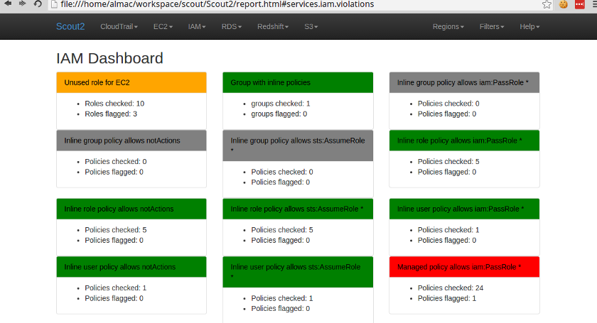

.. role:: strike

Hardening AWS Environments
==============================================================================

and
===

Automating Incident Response
===============================

Andrew Krug

@andrewkrug : Twitter

----------------

It's Always Cloudy in Portland
================================

.. image:: static/pwnie.png
   :height: 600px

ImageCredit: OddDuckart
http://bit.ly/2cl6qJ2

-----------------

About Us
==========

.. image:: static/team.png

.. note:: Andrew Speaks

-----------------

New People
====================

* Toni De la Fuente from Blyx.com
* Amazon Web Services

-----------------

Important Things
==================

* We are not a corporation
* No one pays us to do this
* Everything we're going to talk about is FOSS

Other important things
-----------------------

* All of us on the ThreatResponse Team have our day jobs.
* These are our opinions not the opinion of our employer.

.. note:: Andrew Speaks

-----------------

Download the Slides
===================

* http://threatresponse.cloud
* http://threatresponse.cloud/bsidespdx

.. note::  Andrew Speaks

-------------------

What's going on in AWS Security: Blog Posts
===========================================

Daniel Grezelak
----------------------------------------------

 - `Backdooring an AWS account <https://danielgrzelak.com/backdooring-an-aws-account-da007d36f8f9>`_

 - `Exploring an AWS account post-compromise <https://danielgrzelak.com/exploring-an-aws-account-after-pwning-it-ff629c2aae39?source=latest>`_

 - `Disrupting AWS logging <https://danielgrzelak.com/disrupting-aws-logging-a42e437d6594?source=latest>`_

Toni de la Fuente
----------------------------------------------
 - `Cloud Forensics: CAINE7 on AWS <http://blyx.com/2016/06/16/cloud-forensics-caine7-on-aws/>`_

 - `Forensics in AWS: an introduction <http://blyx.com/2016/03/11/forensics-in-aws-an-introduction/>`_

Eric Hammond
----------------------------------------------

 - `AWS IAM "ReadOnlyAccess" Managed Policy is Too Permissive (For Us) <https://alestic.com/2015/10/aws-iam-readonly-too-permissive/>`_

.. note:: Alex Speaks

-----

What's going on in AWS Security: Blackhat Talks
===============================================

Dan Amiga and Don Knafo
----------------------------------------------

 - `Account Jumping, Post Infection Persistence, and Lateral Movement in AWS <http://ubm.io/2dfeStx>`_

Loic Simon
----------------------------------------------

 - `Access Keys will kill you before you kill the password <http://ubm.io/2czdg9S>`_

This Talk, v1
---------------

 - `Hardening AWS Environments and Automating Incident Response for AWS Compromises <https://s3-us-west-2.amazonaws.com/threatresponse-static/us-16-Krug-Hardening-AWS-Environments-and-Automating-Incident-Response-for-AWS-Compromises-wp.pdf>`_

.. note:: Andrew Speaks

-------------------------

IR in AWS: Preparation
======================================

Understand the Environment
--------------------------

 - `Amazon AWS Security Best Practices Guide <https://d0.awsstatic.com/whitepapers/Security/AWS_Security_Best_Practices.pdf>`_

 - `CIS AWS Foundations Benchmark <https://d0.awsstatic.com/whitepapers/compliance/AWS_CIS_Foundations_Benchmark.pdf>`_

Develop an Incident Response Plan
----------------------------------

 - Tom Arnold's `Incident Response in Amazon EC2: First Responders Guide to Security Incidents in the Cloud <https://www.sans.org/reading-room/whitepapers/incident/incident-response-amazon-ec2-first-responders-guide-security-incidents-cloud-36902>`_

.. note:: Alex Speaks

----

IR in AWS: Preparation
======================================
`Awesome Incident Response <https://github.com/meirwah/awesome-incident-response>`_
-----------------------------------------------------------------------------------------------------------------------------------------

.. image:: static/awesome-ir-1.png

.. note:: Alex Speaks

----

IR in AWS: Preparation
======================================
`Awesome Incident Response <https://github.com/meirwah/awesome-incident-response>`_
-----------------------------------------------------------------------------------------------------------------------------------------

.. image:: static/awesome-ir-2.png

.. note:: Alex Speaks

----

IR in AWS: Preparation
======================================
`Awesome Incident Response <https://github.com/meirwah/awesome-incident-response>`_
-----------------------------------------------------------------------------------------------------------------------------------------

`Awesome Search <https://awesomelists.top>`_

 - Curates awesome lists for you
 - Security category includes Incident Response, Malware Analysis, etc

.. image:: static/awesome-ir-3.png

.. note:: Alex Speaks

----

IR in AWS: Prep - Hardening
======================================

Best Practices Auditing
-----------------------

 - `AWS Trusted Advisor <https://aws.amazon.com/premiumsupport/trustedadvisor/>`_

 - `AWS Config / Config Rules <https://aws.amazon.com/config/>`_

 - `Prowler <https://github.com/Alfresco/aws-cis-security-benchmark>`_

 - `Scout2 <https://github.com/nccgroup/Scout2>`_

 - `CloudCustodian <https://github.com/capitalone/cloud-custodian>`_

 - `SecurityMonkey <https://github.com/Netflix/security_monkey>`_

IAM User / Policy Auditing
----------------------------

 - `Access Advisor <http://docs.aws.amazon.com/IAM/latest/UserGuide/access_policies_access-advisor.html>`_
 - `Using CloudTrail Logs <http://threatresponse.cloud/blog/2016/tips_for_least_privilege_iam_policies.html>`_
 - Video: `AWS (SEC305) How to Become an IAM Policy Ninja in 60 Minutes or Less <https://www.youtube.com/watch?v=Du478i9O_mc>`_

.. note:: Alex Speaks
  Part of being prepared is hardening your systems and environment. But you can't just set it up and walk away, you should have a system of consistently evaluating your state to make sure your following the best practices.

------

IR in AWS: Prep - Hardening
======================================

`AWS Trusted Advisor <https://aws.amazon.com/premiumsupport/trustedadvisor/>`_
-------------------------------------------------------------------------------

.. image:: static/aws_trusted_advisor.png

.. note:: Alex Speaks

  Trusted Advisor provides guidance to help you provision your resources following AWS best practices.

  Not just security. Also performance and cost.

  around 12 built in checks, but only 3 or 4 for free

  Full checks come with a business or enterprise support plan starting at 100 a month.

  No API

  But it is CEO Friendly.

.. note:: Alex Speaks

------

IR in AWS: Prep - Hardening
======================================

`AWS Config / Config Rules <https://aws.amazon.com/config/>`_
-------------------------------------------------------------------------------

.. image:: static/config-start.png

`AWS Blog: Dynamic Compliance Checking for Cloud Resources <https://aws.amazon.com/blogs/aws/aws-config-rules-dynamic-compliance-checking-for-cloud-resources/>`_

.. note:: Alex Speaks

  Config deals with logging what is called a configuration item for supported AWS resources whenever a supported resource is created, deleted, or changed.

  Supported resource are things like ec2 instances, VPCs, iam users. This historical record allows you to answer the question, what policies were attached to a particular user at some time.

  AWS Config rules is a distinct offering from config. Config Rules evaluates the configuration item against a set of predefined critieria

  AWS provides a set of configurable rules users may use, as well as the ability to make custom rules.

  Configuration items are one third of a cent. Config rules are $2/month with 20,000 evals. Further evals are $0.1 per 1,000.

------

IR in AWS: Prep - Hardening
======================================

`Prowler <https://github.com/Alfresco/aws-cis-security-benchmark>`_
-------------------------------------------------------------------------------

.. image:: static/prowler.png
    :align: center

.. note::
  By our friend Toni De La Fuente

  **What we love about it!**

  * CIS Benchmarking Tool
  * Can run out of your cloud
  * Meaningful report data
  * Actionable changes

  Just under 1000 Lines of Code

.. note:: Alex Speaks

------

IR in AWS: Prep - Hardening
======================================

`Scout2 <https://github.com/nccgroup/Scout2>`_
-------------------------------------------------------------------------------

.. note:: Alex Speaks

  By NCC Group. 63 rules. Easy to add your own.

  Dead simple to use. Good Error Handling.

  Simple Reporting.

------

IR in AWS: Prep - Hardening
======================================

`CloudCustodian <https://github.com/capitalone/cloud-custodian>`_
-------------------------------------------------------------------------------

**What we love about it!**

* Rule Based Approach
* Large coverage
* Can run on premise or in another account
* It solves real compliance problems that you have

.. note:: Alex Speaks

    Cloud custodian is a rule engine for evaluation custom policies.

    It covers a lot of the aws surface area: ~60 services and resources, ~160 actions.

    Stateless

    Made public back in feb and still has frequent updates.

----

IR in AWS: Prep - Hardening
======================================

`SecurityMonkey <https://github.com/Netflix/security_monkey>`_
-------------------------------------------------------------------------------

.. image:: static/item_with_issue.png
    :align: center
    :width: 840px

Image Credit: http://securitymonkey.readthedocs.io/en/latest/quickstart.html

.. note:: Alex Speaks

    A part of Netflix's SimianArmy suite of infrastructure tools.

    Similar to Config it'll track item states over time and create a security scorecard.

    Biggest Diff: this is statefull, you set up the infra and it runs periodic checks and logs findings

    Example picture shows justifying an event, which you can then revisit later.

------------------------------

IR in AWS: Prep - Hardening
======================================

Which tool should use use?
-------------------------------

 * *Whatever works best for your environment*
 * Experiment with multiple tools

Implement Something Immediately
--------------------------------

 * Start with simple tools like Prowler or Scout2
 * Move on to more complex tools as needed.

.. note:: Alex Speaks

------------------------------

IR in AWS: Prep - Hardening
======================================

Best Practices Auditing
-----------------------

 - `AWS Trusted Advisor <https://aws.amazon.com/premiumsupport/trustedadvisor/>`_

 - `AWS Config / Config Rules <https://aws.amazon.com/config/>`_

 - `Prowler <https://github.com/Alfresco/aws-cis-security-benchmark>`_

 - `Scout2 <https://github.com/nccgroup/Scout2>`_

 - `CloudCustodian <https://github.com/capitalone/cloud-custodian>`_

 - `SecurityMonkey <https://github.com/Netflix/security_monkey>`_

*IAM User / Policy Auditing*
----------------------------

 - `Access Advisor <http://docs.aws.amazon.com/IAM/latest/UserGuide/access_policies_access-advisor.html>`_
 - `Using CloudTrail Logs <http://threatresponse.cloud/blog/2016/tips_for_least_privilege_iam_policies.html>`_
 - Video: `AWS (SEC305) How to Become an IAM Policy Ninja in 60 Minutes or Less <https://www.youtube.com/watch?v=Du478i9O_mc>`_

.. note:: Alex Speaks
  Moving on to IAM User and Policy Auditing.

  Differes from last section where we looked at different tools to check for compliance wiht best practices

  Here we are going to talk specificaly about the best practice of least privilege.

----

IR in AWS: Prep - Hardening
======================================

Access Advisor
-------------------------------

.. image:: static/access-advisor.png

.. note:: Alex Speaks
    Access Advisor is a tab located in the IAM Web console

    the last time a user performed an action against an AWS service.

    check users for permissive policies.

    But no automation and not detailed enough.

------------------------------

IR in AWS: Prep - Hardening
======================================

Blog Post: `Policy Tuning with CloudTrail <http://threatresponse.cloud/blog/2016/tips_for_least_privilege_iam_policies.html>`_

.. code-block:: bash

    almac@box ~/Downloads $ cat 114406602329_CloudTrail_us-east-1_20160913* |  \
      jq -c \
      '.Records[] |
        {
         eventName: .eventName,
         userName: .userIdentity.userName,
         eventSource: .eventSource
        } |
        select(.userName=="threatpreppolicytest") |
        [.eventSource, .eventName]' \
    | sort | uniq

    ["cloudtrail.amazonaws.com","DescribeTrails"]
    ["ec2.amazonaws.com","DescribeFlowLogs"]
    ["ec2.amazonaws.com","DescribeRegions"]
    ["ec2.amazonaws.com","DescribeVpcs"]
    ["iam.amazonaws.com","GenerateCredentialReport"]
    ["iam.amazonaws.com","GetCredentialReport"]
    ["iam.amazonaws.com","ListAttachedUserPolicies"]

Video: `AWS (SEC305) How to Become an IAM Policy Ninja in 60 Minutes or Less <https://www.youtube.com/watch?v=Du478i9O_mc>`_

.. note:: Alex Speaks
    If you want API specific auditing
    Best for policies, not users.

------------------------------

IR in AWS: Prep - Hardening
======================================

Practice
-------------------------------

* Have a test environment
* Security simulations & IR Game Days

 * `AWS re:Invent 2015 | (SEC316) Harden Your Architecture w/ Security Incident Response Simulations <https://www.youtube.com/watch?v=u-mRU44Q5u4>`_

* **Note**: Tell Amazon before you practice

 * https://aws.amazon.com/security/penetration-testing/

.. note:: Alex Speaks

------------------------------

Today's Agenda
===============

AWS Developments in the Last Year
-------------------------------------

*Incident Response within AWS*
-------------------------------------

 - Preparation
 - *Identification*
 - Containment
 - Eradication

Advanced Attacks and Defenses in AWS
-------------------------------------

Final Tips & Resources
-------------------------------------

.. note:: Alex Speaks
  Recap of Preparation: Understand the environment, harden and audit, and keep an I on user permissions.

  Moving on to Identification: Detect malicious activity at the AWS (not instance) level.

-------------------------

IR in AWS: Identification
======================================

CloudTrail
-------------------------------

.. image:: static/cloudtrail.png

.. note:: Andrew Speaks

-----------

IR in AWS: Identification
======================================

CloudWatch
-------------------------------

.. image:: static/cloudwatch-createalarm.png

.. note:: Andrew Speaks

----

IR in AWS: Identification
======================================

`AWS CloudFormation Template For Security Events in CloudTrail <https://console.aws.amazon.com/cloudformation/home?region=us-east-1#/stack/detail?stackId=arn:aws:cloudformation:us-east-1:114406602329:stack%2FCloudWatchAlarmsForCloudTrail%2F24762880-5737-11e6-8abc-50d5cd148236>`_

.. image:: static/cloudwatch-notification.png

.. note:: Andrew Speaks
    The CloudWatchAlarmsForCloudTrail CloudFormationTemplate.

    Auth failures (denials)

    CloudTrail Changes

    Console Signin Failures

    Ec2 Instance Changes

    Gateway changes

    IAM Policy Changes

    Network AclChanges

    SecurityGroupChanges

    VpcChanges

    Andrew will give another example of detection in CloudWatch.

----

Today's Agenda
===============

AWS Developments in the Last Year
-------------------------------------

*Incident Response within AWS*
-------------------------------------

 - Preparation
 - Identification
 - *Containment*
 - Eradication

Advanced Attacks and Defenses in AWS
-------------------------------------

Final Tips & Resources
-------------------------------------

.. note:: Andrew Speaks
    To conclude the Identification section

    Leverage CloudTrail, CloudWatch Alarms.

-------------------------

IR in AWS: Containment
======================================

Using aws_ir to:
-----------------

Contain a Host Compromise

and
---

Contain a Key Compromise

.. note:: Andrew Speaks

     Explain AWS_IR. Contains and collects forensic evidence.

----

IR in AWS: Containment
======================================

Containing a Host Compromise
-------------------------------

 - Implement a security group to block all in/out traffic except to whitelist.
 - Coming soon to aws_ir: add a network ACL.

aws_ir usage
---------------

.. code-block:: bash

    aws_ir host_compromise 1.2.3.4

.. note:: Andrew Speaks
   2 Things to contain a host:

   New Security Group

   Change network ACL to sever established connections.

---------

IR in AWS: Containment
======================================

Containing a Key Compromise
-------------------------------

 - Disable the access key.
 - Coming soon to aws_ir: Block STS Tokens.

aws_ir usage
---------------

.. code-block:: bash

    aws_ir key_compromise AYAabyabyabyabyabya

.. note:: Andrew Speaks
   2 Things to contain a key:

   Disable the access key

   Block STS tokens, possiblly revoke all policies for that user until you understand what happened.

---------

Host Compromise leads to
=========================
Key Compromise
==================================

Ever heard of the metadata service?
-------------------------------------

.. note:: Andrew Speaks

   Host compromise leads to Key compromise from the metadata service

-----------------

**MetaData Service**

.. code-block:: bash

    https://aws.amazon.com/amazon-linux-ami/2016.03-release-notes/
    13 package(s) needed for security, out of 26 available
    Run "sudo yum update" to apply all updates.
    [ec2-user@ip-172-31-37-29 ~]$ curl http://169.254.169.254/latest/meta-data/
    ami-id
    ami-launch-index
    ami-manifest-path
    block-device-mapping/
    hostname
    iam/
    instance-action
    instance-id
    instance-type
    local-hostname
    local-ipv4
    mac
    metrics/
    network/
    placement/
    profile
    public-hostname
    public-ipv4
    public-keys/
    reservation-id
    security-groups

.. note:: Andrew Speaks

   Just curl a URL and you can get all kinds of information.

-----------------

**Determine Instance Profile**

.. code-block:: bash

    curl http://169.254.169.254/latest/meta-data/iam/info
    {
      "Code" : "Success",
      "LastUpdated" : "2016-09-21T17:00:07Z",
      "InstanceProfileArn" : "arn:aws:iam::671642278147:instance-profile/\

      cloudresponse_workstation-cr-16-080120-e5c0-us-west-1",

      "InstanceProfileId" : "AIPAJJWTONXQ7CLMRENCO"
    }

.. note:: Andrew Speaks

   Curl /iam/info to get the role name from the InstanceProfileARN. Once you get the role name

-----------------

**Once you know the role name**

.. code-block:: bash

    curl http://169.254.169.254/latest/meta-data/iam/\
    security-credentials/cloudresponse_workstation-cr-16-080120-e5c0-us-west-1
    {
      "Code" : "Success",
      "LastUpdated" : "2016-09-21T17:00:55Z",
      "Type" : "AWS-HMAC",
      "AccessKeyId" : "ASIAJDU**********REDACTED",
      "SecretAccessKey" : "q7bVQVlV+9/ktjWgh5******REDACTED",
      "Token" : "FQoDYXdzEGIaDGlEkwRSH8hHG+Oz***********REDACTED",
      "Expiration" : "2016-09-21T23:05:14Z"
    }

Winning!
================================

.. note:: Andrew Speaks

   Query for the security credentials for that role and you can get access key id and secret.

-----------------

So what?
===============

You can protect against this
--------------------------------

Good old iptables to the rescue.

.. code-block:: bash

    iptables -A OUTPUT -m owner ! —uid-owner root -d 169.254.169.254 -j DROP

.. note:: Andrew Speaks

   Implement IP tables so only the processes owned by root can query the service.

-----------------

Key Compromise leads to
=========================
Host Compromise
==================================

 1. Snapshot Disk for Targeted Host

 2. Mount Snapshot onto attacker-controlled image

 3. ???

 4. Profit!

.. note:: Andrew Speaks

   Read steps.

   This may or may not actually get you on the box, depending on setup. But its possible /etc/shadow might show some weak hashes, or the credentials to the database are stored in plaintext some where.

-----------------

Today's Agenda
===============

AWS Developments in the Last Year
-------------------------------------

*Incident Response within AWS*
-------------------------------------

 - Preparation
 - Identification
 - Containment
 - *Eradication*

Advanced Attacks and Defenses in AWS
-------------------------------------

Final Tips & Resources
-------------------------------------

.. note:: Andrew Speaks

  In conclusion, contain quickly so host compromises and key compromises don't pile up.

-------------------------

IR in AWS: Eradication
=======================

 .. raw:: html

     

     

.. note:: Alex Speaks

    For eradication, focus on performing forensics on a compromised host to understand the extent of the breach, ensure we contained it, and determine the problem that needs to be patched.

    In this video you'll see aws_ir run against a compromised host.

    We should note its running at 5x speed.

    It will contain the host, and then it will start extracting all the forensic evidence it can.

    Lets Discuss what evicence to collect.

----

IR in AWS: Eradication
=======================

Evidence Data to Collect
---------------------------

 1. AWS Data
 2. Disk
 3. Memory
 4. Network

And store in a case specific S3 bucket
-----------------------------------------

.. note:: Alex Speaks
  You'll want to collect AWS specific data, disk, memory and Network data.

  At this time aws_ir collects the AWS, Disk and Memory Data.

----

IR in AWS: Eradication
=======================

Evidence Data to Collect: AWS Data
-----------------------------------------

 1. EC2 Console Output
 2. EC2 Console Screenshot
 3. AWS Meta-Data

  - Attached Device Volume IDs
  - Network Devices and Local / Public IPs
  - AMI-ID

 4. Relevant CloudTrail Logs

  - Coming soon to aws_ir

.. note:: Alex Speaks

----

Memory
====================

Insert Coin To Hear A BSides Presentation on This

----

IR in AWS: Eradication
=======================

Evidence Data to Collect: Network
-----------------------------------------

**You may get some network information from memory**

**More information from VPC Flow Logs**
 - Coming soon to aws_ir

.. note:: Alex Speaks

---------------------

IR in AWS: Conclusion
=======================

Covered Lots of Preparation Tools
---------------------------------

Trusted Advisor, Config, Prowler, Scout2, CloudCustodian, SecurityMonkey

Takeaways
----------

 - Customize tooling for your environment
 - Use all (or parts) our code.  **It's MIT Licensed**
 - Practice, Practice, Practice

.. note:: Alex Speaks

------

Attack Time!
==============================

Trivia Question
----------------

Who Said: "Defense without Offense is after all just Compliance."

---------------------------

A: "Dan Kaminsky in Read My Lips: Let’s Kill 0Day"

.. image:: static/kaminsky.jpg
   :align: center

-----------------------------

AWS Advanced Attacks
================================

* Logging Disruption
* STS Persistence
* *New* Super Cool API Gateway Persistence

------------------------------

PSA : GroundRules
=============================

.. image:: static/boring.jpg
    :align: center

Non-Boring Material Ahead!
----------------------------

------------------------------

Logging Disruption
===============================================

Three Variations of This
---------------------------

1. Just Stop Trail - Boring
2. Stop Regional Logging or Global Logging - Less Boring
3. Make CloudTrail operate but logs are unreadable - Best!!

------------------------------

The Cool Attack
======================================

This is your CloudTrail
------------------------------------

.. image:: static/normalcloudtrail.png
    :align: center

------------------------------

**This is your CloudTrail on Crypto**

.. image:: static/badcloudtrail.png
    :align: center

----------------------------------

When the attack happens...
==============================================

.. image:: static/moneyfire.jpg
    :align: center

The “bypass-policy-lockout-safety-check” flag allows you the make the key’s
policy immutable after creation, making logging just an exercise in lighting
money on fire with disk consumption. You can’t say Amazon didn’t warn you!
- @danielgrzelak

----------------------------------

.. image:: static/sowhat.png
    :align: center

1. Requires a high level of privilege
2. Handy for remaining undetected
3. Not necessarily undetectable...

----------------------------------

Not Normal Activities Here
==============================

.. image:: static/moon.gif
    :align: center

1. Creating KMS Keys with this weird policy
2. Calling update trail on your cloudtrail

----------------------------------

http://bit.ly/2cnpTsK
=================================

There's an article about this type of detection.
----------------------------------------------------

.. image:: static/doda.png
    :align: center

----------------------------------

CloudWatch Event Pipelines
=========================================

For the win
-------------------

.. image:: static/cloudwatch.png
    :align: center

----------------------------------

Video of CloudWatch Pipeline : Skipping
===========================================

.. raw:: html

    <video width="824" height="376" controls>
      <source src="videos/advcloudtrail.webm">
    Your browser does not support the video tag.
    </video>

----------------------------------

STS Attacks
======================================

.. image:: static/sts.png
    :align: center

----------------------------------

How do they happen?
=====================================

1. Metadata Compromise
2. As a result of key compromise
3. Leaked through an application running in a role

----------------------------------

How do you generate them?
=======================================

.. code-block:: bash

    kali:$ aws sts get-session-token --duration-seconds 129600

---------------------------------

What you get back
==========================

.. code-block:: bash

    {
        "Credentials": {
            "SecretAccessKey": "S/aDDL86juKF3*****************************",
            "SessionToken": "FQoDYXdzEG***********************************",
            "Expiration": "2016-09-23T05:26:51Z",
            "AccessKeyId": "ASIAJ5*****************************"
        }
    }

---------------------------------

So what?
==================================

1. You can't revoke temporary STS tokens
2. Without CloudTrail you have no way to know how many exist
3. Someone can use these to end you

--------------------------------

How do you
=================================

defend against STS?
=====================

--------------------------------

You don't.
=============

--------------------------------

J/K
=======================

.. image:: static/disable-sts.png
    :align: center

-------------------------------

Three Supported Techniques
=================================

1. Denying Access to the Creator
2. Denying Access to by Name

3. **Denying Access to Credentials
Issued Before xx/xx/xx 00:00:00**

-------------------------------

Time Based Revocation
====================================

.. code-block:: bash

    {
      "Version": "2012-10-17",
      "Statement": {
        "Effect": "Deny",
        "Action": "*",
        "Resource": "*",
        "Condition": {"DateLessThan": {"aws:TokenIssueTime": "2014-05-07T23:47:00Z"}}
      }
    }

1 and done policy attach to all roles
---------------------------------------

--------------------------------

Go defend!
==================

.. image:: static/yoda.jpg

--------------------------------

Backdoors via API Gateway!
==========================================

.. image:: static/apigw.jpg

--------------------------------

Serverless is the Future
============================

I agree!
-------------------

--------------------------------

Serverless is the future!
====================================

Of attacks!
=======================

--------------------------------

What could you do with serverless attacks?
============================================

1. Backdoors
2. Exfiltrate data via http
3. Run a CNC for BotNet
4. Run a ransomware backend....

Endless Possibility
----------------------

--------------------------------

Why make a backdoor tool?
==============================

Trivia Question
----------------

Who Said: "It was once my job to think as Dark Wizards do?"

-----------------------------

.. code-block:: bash

    Professor Moody: The Goblet of Fire is an exceptionally powerful magical object.
    Only an exceptionally powerful Confundus charm could have hoodwinked it!
    Magic way beyond the talents of a fourth year.
    Igor Karkaroff: You seem to have given this a fair bit of thought, Mad-Eye!

A: "Mad Eye Moody"

.. image:: static/moody.gif

-----------------------------

Mad King Demo
=================================

.. image:: static/madking.png

------------------------------

.. raw:: html

    

    

-------------------------------

.. raw:: html

    <video width="824" height="376" controls>
      <source src="videos/madking.webm">
    Your browser does not support the video tag.
    </video>

-------------------------------

Did we just burn them all?
===================================

-------------------------------

So what?
==================

1. Small payload
2. Gives you persistence
3. Cleans up it's own logs when it goes away
4. Most platforms probably aren't auditing serverless
5. No security groups for APIGateway endpoints

-------------------------------

How do we even begin to protect ourselves?
===========================================

------------------------------

No less than:
===========================================

Three Dumb Clouds
------------------

.. image:: static/dev-in-aws.png
    :align: center

Is this three dumb clouds?

--------------

Nah... this is three dumb clouds
===================================

.. image:: static/seperated-envs.png
    :align: center

--------------

Maybe we need four clouds
============================

.. image:: static/securitycloud.jpg
    :align: center

------------------------------

We love OSS Projects
=============================

* CapitalOne
* Netflix
* Yelp!
* Prezi
* Individual Contributors

------------------------------

Want more information?
==========================================

Subscribe to our mailing list
--------------------------------

http://www.threatresponse.cloud

------------------------------

Thank Yous and Announcements
==========================================

* Amazon Web Services Security
      Don Bailey, Henrik Johansson, Zack Glick
* BSides PDX Staff
* Toni De la Fuente
* Team Who Couldn't Be with Us Today ( Alex )

-----------------------------

Fin
=======
